# 🛍️ FakeStore Catalog

Aplicación desarrollada con React, TypeScript, Vite y Shadcn UI que consume datos desde la API pública FakeStore API para mostrar un catálogo de productos con navegación entre páginas y visualización de entidades.

---

## 📋 Descripción

Este proyecto consiste en una mini aplicación web que consume productos desde una API pública y los presenta mediante una interfaz moderna y responsiva.

La aplicación permite:

* Consultar productos desde una API externa.
* Visualizar productos mediante tarjetas.
* Navegar entre distintas páginas usando React Router.
* Mostrar información detallada de entidades.
* Aplicar estilos modernos con Tailwind CSS y Shadcn UI.

---

## 🛠️ Tecnologías utilizadas

* React 19
* TypeScript
* Vite
* React Router DOM
* Axios
* Tailwind CSS v4
* Shadcn UI
* FakeStore API

---

## 🌐 API utilizada

https://fakestoreapi.com/products

---

## 📂 Estructura del proyecto

```text
src/
├── components/
├── layouts/
├── pages/
├── routes/
├── services/
├── types/
├── App.tsx
└── main.tsx
```

---

## ⚙️ Instalación

Clonar el repositorio: 

```bash
git clone https://github.com/naomi2200/evalue12.git
```

Ingresar al proyecto:

```bash
cd fakestore-react
```

Instalar dependencias:

```bash
npm install
```

Ejecutar servidor:

```bash
npm run dev
```

---

## 🚀 Funcionalidades implementadas

### 🏠 Home

* Hero principal.
* Catálogo de productos.
* Imágenes.
* Precios.
* Diseño mediante Cards de Shadcn UI.

### 📜 Entities

* Tabla de entidades.
* Visualización de:

  * ID
  * Título
  * Precio
  * Categoría

### 🔗 Navegación

* Ruta Home (/)
* Ruta Entities (/entities)
* Navegación mediante React Router.

### 🌐 Consumo de API

* Consumo de FakeStore API utilizando Axios.
* Renderizado dinámico de productos.

---

## 📸 Evidencias

### Instalación del proyecto


## 📸 Evidencias

### Instalación del proyecto

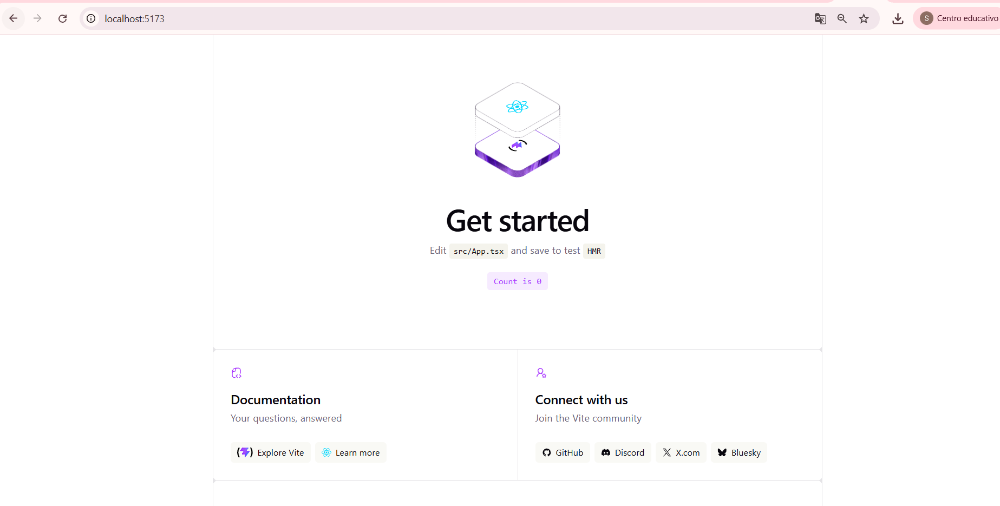

### Instalación de React Compiler

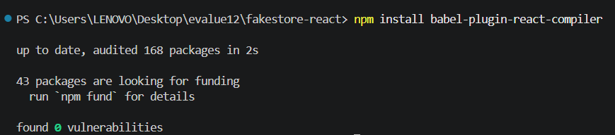

### Configuración de Tailwind CSS

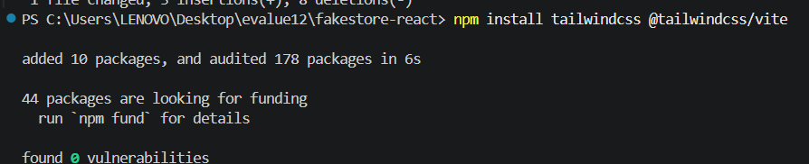

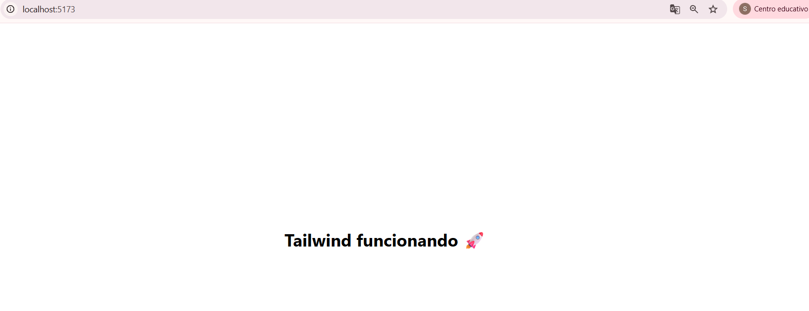

### Instalación de Shadcn UI

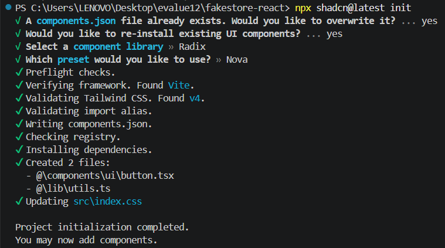

### Configuración de Shadcn UI

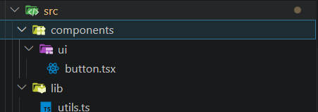

### Configuración de rutas

#### Ruta Home

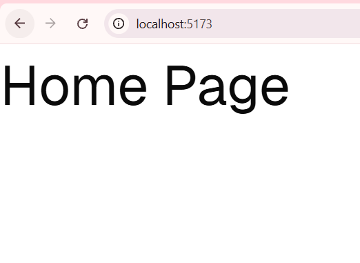

#### Ruta Entities

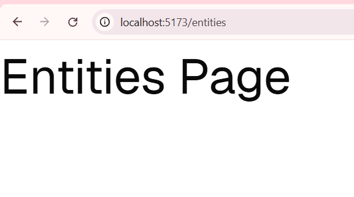

### Consumo de la API FakeStore

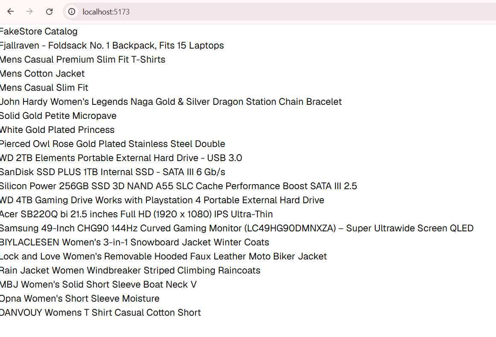

### Catálogo de productos

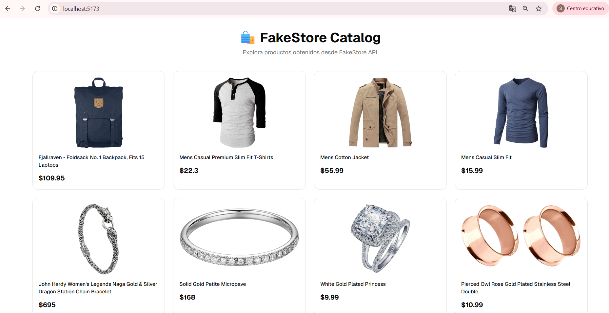

### Vista de entidades

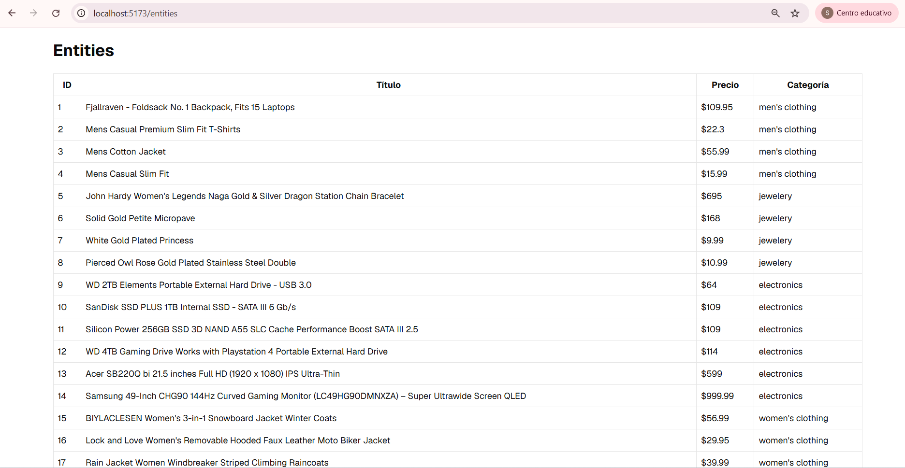

### Navegación entre páginas

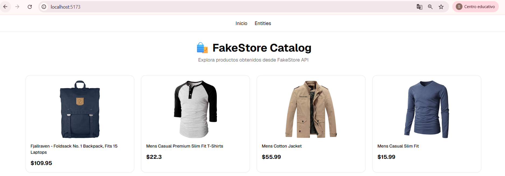

## 🌎 Deploy

Enlace de producción:

```text
PENDIENTE
```

---

## 🎥 Video demostrativo

Video de presentación:

```text
PENDIENTE
```

---

## 👨‍💻 Autor

Solanch Naomi Veliz Pie

Proyecto desarrollado para la evaluación de React utilizando Vite, TypeScript, Tailwind CSS, Shadcn UI y consumo de APIs públicas.
